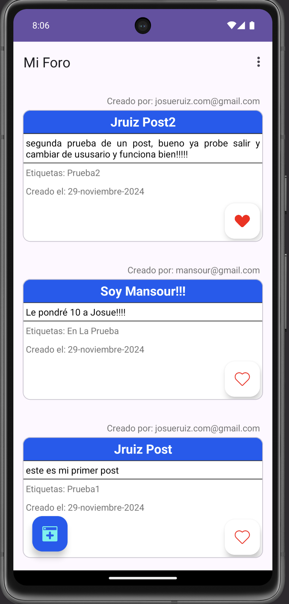
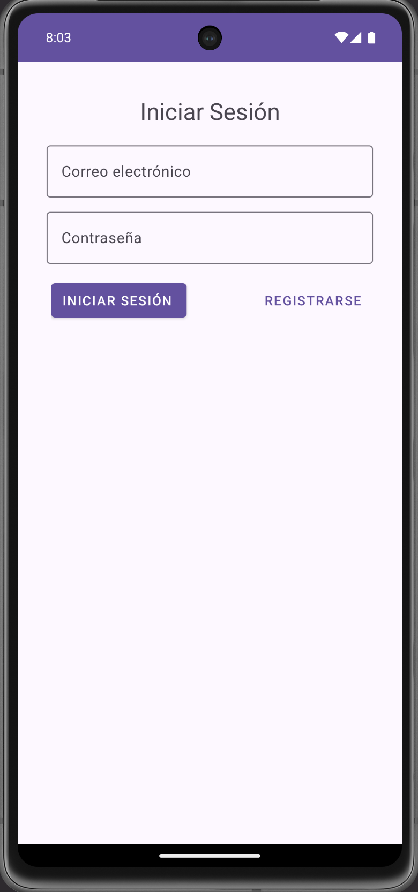

# Mi Foro

Proyecto de Prueba: App para crear Post.

Para logearse:

Usuario: josueruiz.com ignorrar1234 @ gmail.com

Contraseña: 123456

Permite crear, modificar y eliminar Post, que se guardan en base de datos local SQLite en el móvil.

## Imágenes

## Requerimientos:

 - Desarrollo de una APP: Listo ⭐
 - Contener al menos tres actividades: Login ⭐ Main ⭐ Crear Post ⭐
 - Pasar parametros en almenos dos actividades, recuperarlo y usarlo en una segunda actividad: Edit ⭐ Menu desplegable ⭐
 - Mostrar al menos un diálogo en respuesta a una accion del usuario: Al crear, Modificar, eliminar post ⭐
 - Implementar sistema de sesión mediante SharedPreferences: Login ⭐ Posteos ⭐ Me gusta ⭐
 - Uitlizar RecyclerView para mostar una lista y capturar un evento de click en cada elemento: Post ⭐ Editar ⭐ Eliminar ⭐
 - Investigar y usar TextField: En el formulario y al crear post ⭐
 - Usar ViewBinding en vez de findViewById(resId: Int): Listo ⭐
 - Mostrar un menú en la AppBar (barra superior): Listo ⭐
 - Internacionalización (un idioma es suficiente): Listo ⭐

## Tech Stack

**Utilizando:** Android Studio, Kotlin.

## License

[MIT](https://choosealicense.com/licenses/mit/)
